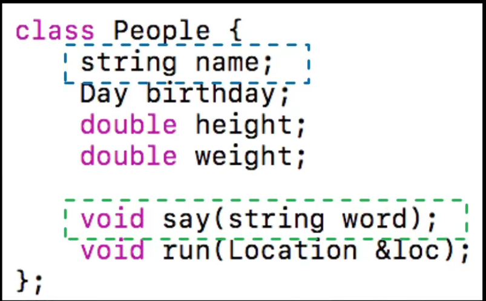
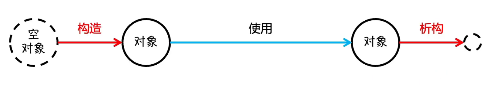
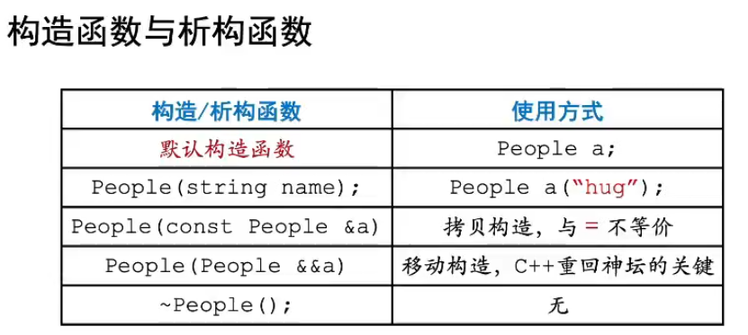

封装主要分为两类，一类是对数据的封装，一类是对功能的封装，并且我们在C语言中就做过这些事情，并不陌生，比如函数封装功能，结构体封装数据。

## 类的基本封装
### 基本认识类和对象
> 说白了，类是一种自定义的类型，我们可以自定义其中的数据结构，还有这个类型可以进行的操作，即`类型 = 类型数据 + 类型操作`，而对象和类的关系类似于变量和数据类型的关系。

#### 成员属性和方法
说白了，成员属性就是上述等式中的**类型数据**，而成员方法就是**类型操作**，例如：

成员属性的定义和调用和C语言中结构体的部分一模一样，而具体的成员方法实现和C语言的函数编写基本一样，只不过在类内实现，请看接下来的代码演示：
```cpp

#include <iostream>
using namespace std;

class People {
public:
    string name;
    int age;

    void self_intro() {
        cout << "I'm " << name << ", " << age << " years old" << endl;
    }
};

int main() {
    People Jim("Jim", 14);
    Jim.self_intro();
    return 0;
}
```
输出
```
I'm Jim, 14 years old
```
细心的朋友可能发现了类的定义和结构体的不同除了新增属性方法之外，还有一个陌生的关键字`public`，这会在接下来的一节中介绍，这里读者只需要知道，没有这行代码，编译会报错`error: 'void People::self_intro()' is private within this context`。

### 访问控制权限
> C++中有四个用于访问控制的关键字，分别是`public`,`private`,`protected`, `friend`。
> 同时也将在这里挑明C++中结构体和类的唯一不同就是默认权限,前者是public，后者是private，其他特性完全一致，也就是说，其实C++中的结构体和C语言中的结构体是不一样的，也可以拥有自己的成员方法。

下面我们来解释一下四个关键字代表什么含义
- public: 公告访问权限，没有限制，被这个关键字作用的成员能被**外界随意访问**
- private: 私有访问权限，全面限制，被这个关键字作用的成员**外部不能访问**
- protected: 受保护的，只有**自己和子类可以访问**
- friend: 定义友元[函数/类]，让其可以**访问自身所有属性和方法**

但是这里读者可能对**子类**会比较陌生，这里先不管，等到继承一章讲到这个概念我们还会再拿出来谈。
接下来请看代码演示：
```cpp
#include <iostream>
using namespace std;

class People {
public:
    string name;
    int age;
private:
    void self_intro() {
        cout << "I'm " << name << ", " << age << " years old" << endl;
    }
    friend int main();

};

int main() {
    People Jim("Jim", 14);
    Jim.self_intro();
    Jim.age = 15;
    Jim.self_intro();
    return 0;
}
```
可以看到我们把`self_intro`改为私有之后，main函数依旧可以调用这个函数，原因是因为mian函数已经被声明为友元，但是如果main函数再委托其他函数来完成这个函数调用就不行，如下所示：
```cpp
#include <iostream>
using namespace std;

class People {
public:
    string name;
    int age;
private:
    void self_intro() {
        cout << "I'm " << name << ", " << age << " years old" << endl;
    }
    friend int main();

};

void helper(People& p){
    p.self_intro();
}

int main() {
    People Jim("Jim", 14);
    Jim.self_intro();
    Jim.age = 15;
    Jim.self_intro();
    helper(Jim);
    return 0;
}
```
```
error: 'void People::self_intro()' is private within this context
   17 |     p.self_intro();
```

> 在此就总结一下`friend`的用法：在类内先写**friend**关键字，后面接上**友元的声明**那部分。

### 对象的生命周期
> 我们在声明并使用一个对象时，一直忽略了一件事，它是怎么来的？总得先内存分配，并进行初始化（构造），然后才能使用吧？并且我们没有关注一件事情，用完对象之后我们是如何抛弃对象（析构）并释放内存的？这就是**构造**和**析构**。


### 构造函数和析构函数

上图很好地概括了C++的主要的构造和析构函数，但是初学者难免感到一头雾水,接下来我们循序渐进的讲解每种构造和析构。

首先是**默认构造**，是由**编译器默认生成的和类同名的无返回值的公有方法**，生成条件是：**没有任何自定义构造**，使用方法如下：
```cpp
#include <iostream>
using namespace std;

class A { };

int main() {
    A a;
}
```
加深理解就是，无参构造函数就是默认构造函数，我们当然也可以人为显示定义这个无参构造函数，记得加上`public`，使用方式不变，但是可以自定义一些初始化规则，比如：
```cpp
#include <iostream>
using namespace std;

class A {
public:
    int property;
    A() {
        property = 0;
        cout << "set property to 0" << endl;
    }
};

int main() {
    A a;
}
```
```
// 输出
set property to 0
```

讲到这里我要补充两点，第一是值初始化，当类**没有任何自定义构造**时，用如下的初始化方式可以将成员属性全部赋值为0:
```cpp
#include <iostream>
using namespace std;

class A {
public:
    int property;
};

int main() {
    A a{};
    cout << a.property;
}
```
须知正常情况下应该是随机的垃圾值，这里输出为`0`。

第二是**聚合初始化**（又叫**初始化列表**），是值初始化的带参数形式，可以按顺序给成员属性赋值:
```cpp
#include <iostream>
using namespace std;

class A {
public:
    int property;
    string name;
};

int main() {
    A a{10, "Ten"};
    cout << a.property << " " << a.name;
}
```
```
10 Ten
```
讲到这里，有读者或许会问，为什么不能用()来显式调用默认构造函数呢，就像下面这样：
```
A a();
```
那我问你，你这是不是一个返回类型是A的一个名为a的函数？于是就会发现这有语法歧义，并且编译器通常会像我这样理解，故不可行，通常就采用{}来显式调用默认构造，有自定义默认构造时调用的就是自定义默认构造，没有则是之前说的值初始化。

---

接下来是**有参构造**，就是**和类同名的自定义的有参数列表的构造函数**，如：
```cpp
#include <iostream>
using namespace std;

class A {
public:
    int property;
    A(int x) {
        property = x;
    }    
};

int main() {
    A a(101);
    cout << a.property;
}
```
但是这个时候默认构造函数就坏了，需要注意，此时我们需要显式写出默认构造函数了，但好处是，这里因为有参数，使用小括号来调用构造函数就不会产生歧义。

---

接下来请读者看一段代码：
```cpp
#include <iostream>
using namespace std;

class A {
public:
    A();
    A(int x, int y) {
        x = x, y = y; // 这样能够成功赋值吗？
    }
private:
    int x, y;    
};

int main() {
    
}
```
我既然这样问，那大概率不行，这是因为类内要访问自身属性要用到**this指针**，这是一个只想对象自身的指针，一个对象唯有通过this指针才能访问到成员属性，所以正确的写法应该是这样：
```cpp
#include <iostream>
using namespace std;

class A {
public:
    A();
    A(int x, int y) {
        this->x = x, this->y = y;
    }
private:
    int x, y;    
};

int main() {
    
}
```
this指针我们之后还会再提，这里先有一个简单的认识。

---

此外还有一个小的知识点叫做**委托构造**，看代码：
```cpp
#include <iostream>
using namespace std;

class A {
public:
    A() : A(100, 100) {};//这种在构造函数声明后面加冒号并调用其他构造函数的方式叫做委托构造
    A(int x, int y) {
        x = x, y = y;
    }
private:
    int x, y;    
};

int main() {
    
}
```
这种在构造函数后面的`:`的后面部分叫做`初始化列表`，除了用于此处的委托构造之外，还有其他写法，可以对成员属性进行初始化：
```cpp
#include <iostream>
using namespace std;

class A {
public:
    A() : x(100), y(100) {};
    A(int x, int y) {
        x = x, y = y;
    }
private:
    int x, y;    
};

int main() {
    
}
```

值得一提，当调用默认构造时，是**先执行初始化列表**中的语句，**后执行其函数体**中的语句。
更深入一点，初始化列表的初始化顺序**并不是**根据初始化列表书写顺序来赋值的，而是按照类中的声明顺序来的。


为什么一定要使用初始化列表呢？其实最重要的考量是提高效率。


---

接下来讲`this指针`，它本质上是一个指针，指向当前对象，所以才能像上面那样访问成员属性，可以通过下面的代码输出结果得到验证：
```cpp
#include <iostream>
using namespace std;

class A {
public:
    A() {
        cout << this << "| default constructor" << endl;
    };
};

int main() {
    A a, b;
    cout << "a: " << &a << endl;
    cout << "b: " << &b << endl;
}
```
```
0x5ec01ffe7f| default constructor
0x5ec01ffe7e| default constructor
a: 0x5ec01ffe7f
b: 0x5ec01ffe7e
```

---

下面讲，有参构造的一种特殊情况——**转换构造**，即**只有一个参数**的情况，这样的构造函数会在**将参数类型的变量赋值给一个对象**时**隐式**地转换为该类对象，请看代码：
```cpp
#include <iostream>
using namespace std;

class A {
public:
    A(int z) : x(z), y(z) {
        cout << this << " convert constuctor" << endl;
    };

    // 重载运算符的知识，看不懂可以先不管
    void operator=(const A &a) {
        this->x = a.x;
        this->y = a.y;
        cout << this << " operator=" << endl;
        return ;
    }
private:
    int x, y;
};

int main() {
    A a(3);
    a = 4;
}
```
```
0xa7087ff960 convert constuctor
0xa7087ff968 convert constuctor
0xa7087ff960 operator=
```
从输出结果看得出这里`4`被**转换构造**转换为了一个A类型的对象，然后再赋值给了a。


> 这个时候就不得不提一个关键字`explicit`，只要在构造函数前加上它，就可以ban掉这种隐式转换，这是C++11引入的新特性，目的是增强代码可读性和可维护性。当然，除了ban掉这种隐式转换，初始化列表隐式转换也可以ban，只需要在多参数初始化函数前加上这个关键字即可。


---

接下来介绍一组很重要的概念，**左值和右值**。

我们必须先理解另一组概念：**值和引用**，说白了，引用就是变量的别名，其必须在声明时完成绑定，其语法是这样的：
```cpp
#include <iostream>
using namespace std;

int main() {
    int a = 123;
    cout << a << endl;
    int &b = a; // 左值引用
    b = 456;
    cout << a << endl;
    int &&c = 11; // 右值引用
    c = 12;
    cout << c << endl;
}
```
- 左值: 持续存在的，可以取地址的，可以出现在赋值语句左侧
- 右值: 字面量或匿名对象，不能出现在赋值语句左侧
- **非const左值引用不能绑定在右值上**
- **左值引用优先绑定到左值上**
- **右值引用优先绑定到右值上**
- 无论是左值引用还是右值引用本质都是引用，除了绑定时的优先级不同，其他都一样，所以根据引用的特性我们容易知道，引用，**无论是左值引用还是右值引用都是左值**。

接下来看一段代码和输出：
```cpp
#include <iostream>
using namespace std;

void tell(int &x) {
    cout << "is left value" << endl;
}
void tell(int &&x) {
    cout << "is right value" << endl;
}
int main() {
    tell(12 + 23);
    tell(123);      // 字面量
    tell(int());    // 匿名变量
    int a;
    tell(a);        // 左值
}
```
```
is right value
is right value
is right value
is left value
```
这里的两个tell函数不会冲突，这涉及到了C++的多态特性，和C语言很不一样，先不用理会，只需要知道，左值会触发第一个tell函数，而右值会触发第二个tell函数。经过实验，我们发现了常见的左值和右值。

当然也有几个不那么常规的判断，我们不在这里演示，交给读者自行思考和实验。
- `++a`
- `a++`

> 说到这里，最后补充一下`std::move(x)`和`std::forward<int&&>(x)`，这俩函数可以把左值转右值。

---

之前我们已经讲完了默认构造和有参构造，接下来我们讲一讲**拷贝构造**。

```cpp
#include <iostream>
using namespace std;

class A {
public:
    A() {
        cout << this << " default constructor" << endl;
    }
    A(const A& a) {
        this->x = a.x;
        this->y = a.y;
        cout << this << " copy constructor" << endl;
    }
    void operator=(const A& a) {
        this->x = a.x;
        this->y = a.y;
        cout << this << " copy operator=" << endl;
    }
private:
    int x, y;
};

int main() {
    A a, b = a;
    b = a; // 一旦进入使用阶段，就和构造函数无关了
}

```
上述代码中`b = a`所用到的就是拷贝构造。

> 那为什么拷贝构造一定要传入**const左值引用**呢？
>
> 首先必须是引用，这是**编译器强制要求**的，因为如果不是引用就会无限调用拷贝构造，但是这是个无限递归。
> 其次是const，这不是必须的，但是如果**被拷贝的是const类型的对象**，那么传入参数不加const就会报错，因为**const变量只能绑定到const类型的引用上面**。

---

接下来我们来聊聊**深拷贝和浅拷贝**这个问题，让我以一段代码来引入：
```cpp
#include <iostream>
using namespace std;

class Array {
    int n, *data;

public:
    Array() : n(10), data(new int[n]) {
        for (int i = 0; i < n; i++) data[i] = 0;
    }
    int size() {
        return n;
    }
    void set(int p, int v) {
        data[p] = v;
    }
    void print() {
        for (int i = 0; i < n; i++) {
            if (i) cout << ' ';
            cout << data[i];
        }
        cout << endl;
    }
};

int main() {
    Array a, b = a;
    a.print();
    b.print();
    for (int i = 0; i < a.size(); i++) {
        a.set(i, 1);
    }
    a.print();
    b.print();
    for (int i = 0; i < b.size(); i++) {
        b.set(i, i);
    }
    a.print();
    b.print();
    return 0;
}
```
```
0 0 0 0 0 0 0 0 0 0
0 0 0 0 0 0 0 0 0 0
1 1 1 1 1 1 1 1 1 1
1 1 1 1 1 1 1 1 1 1
0 1 2 3 4 5 6 7 8 9
0 1 2 3 4 5 6 7 8 9
```
可以看到，无论我怎么反复轮流修改a和b数组，它们的内容始终一致，说明**C++默认的拷贝机制只是简单的逐字段复制内容**(我们称为**浅拷贝**)，这导致a和b数组中的data指针指向了同一块儿内存，这才造成了上述现象。

而**深拷贝**呢，就是有针对性的为字段中的指针变量开辟新的存储区，并把原先的内容全部复制过来，看代码：
```cpp
#include <iostream>
using namespace std;

class Array {
    int n, *data;

public:
    Array() : n(10), data(new int[n]) {
        for (int i = 0; i < n; i++) data[i] = 0;
    }
    Array(const Array& a) : n(a.n), data(new int[n]) {
        for (int i = 0; i < a.n; i++) data[i] = a.data[i];
    }
    int size() {
        return n;
    }
    void set(int p, int v) {
        data[p] = v;
    }
    int get(int p) { return data[p]; }
    void print() {
        for (int i = 0; i < n; i++) {
            if (i) cout << ' ';
            cout << data[i];
        }
        cout << endl;
    }
};

int main() {
    Array a, b = a;
    a.print();
    b.print();
    for (int i = 0; i < a.size(); i++) {
        a.set(i, 1);
    }
    a.print();
    b.print();
    for (int i = 0; i < b.size(); i++) {
        b.set(i, i);
    }
    a.print();
    b.print();
    return 0;
}
```
```
0 0 0 0 0 0 0 0 0 0
0 0 0 0 0 0 0 0 0 0
1 1 1 1 1 1 1 1 1 1
0 0 0 0 0 0 0 0 0 0
1 1 1 1 1 1 1 1 1 1
0 1 2 3 4 5 6 7 8 9
```
此时二者就不会相互影响了，当然这个代码还有一些没有显现出来的bug，这个留到后面再说。

---

接下来说一下**移动构造**，先看代码
```cpp
#include <iostream>
using namespace std;

class Array {
    int n, *data;

public:
    Array() : n(10), data(new int[n]) {
        cout << this << "  default constructor" << endl;
        for (int i = 0; i < n; i++) data[i] = 0;
    }
    Array(const Array& a) : n(a.n), data(new int[n]) {
        cout << this << "  Copy constructor" << endl;
        for (int i = 0; i < a.n; i++) data[i] = a.data[i];
    }
    int size() {
        return n;
    }
    void set(int p, int v) {
        data[p] = v;
    }
    int get(int p) { return data[p]; }
    void print() {
        for (int i = 0; i < n; i++) {
            if (i) cout << ' ';
            cout << data[i];
        }
        cout << endl;
    }
    Array duplicate() {
        return Array(*this);
    }
};

int main() {
    Array a, b = a.duplicate();
    cout << "a: " << &a << endl;
    cout << "b: " << &b << endl;
    return 0;
}
```
```
0xc104bffcc0  default constructor
0xc104bffcb0  Copy constructor
0xc104bffc20  Copy constructor
0xc104bffc80  Copy constructor
a: 0xc104bffcc0
b: 0xc104bffcb0
```

需要注意，这个运行结果需要关一下编译器的拷贝/移动构造优化，加一个`-fno-elide-constructors`参数就可以。

如果说，拷贝构造时对左值的拷贝处理，那么移动构造就是对右值的一个拷贝，本质上是拷贝右值时直接把右值的内存拿过来，反正对于右值这种临时值来说，内存也要释放，那么不如直接转移给左值，这种专门处理临时值的构造函数就是转移构造。

具体的可以这样写
```cpp
#include <iostream>
using namespace std;

class Array {
    int n, *data;

public:
    Array() : n(10), data(new int[n]) {
        cout << this << "  default constructor" << endl;
        for (int i = 0; i < n; i++) data[i] = 0;
    }
    Array(const Array& a) : n(a.n), data(new int[n]) {
        cout << this << "  Copy constructor" << endl;
        for (int i = 0; i < a.n; i++) data[i] = a.data[i];
    }
    int size() {
        return n;
    }
    void set(int p, int v) {
        data[p] = v;
    }
    int get(int p) { return data[p]; }
    void print() {
        for (int i = 0; i < n; i++) {
            if (i) cout << ' ';
            cout << data[i];
        }
        cout << endl;
    }
    Array duplicate() {
        return Array(*this);
    }
};

int main() {
    Array a, b = a.duplicate();
    Array c;
    cout << "a: " << &a << endl;
    cout << "b: " << &b << endl;
    // 若我主观认定c对象即将废弃，那么就会想用移动构造
    // 此时我们就理解了之前左值转右值的函数为什么叫move
    Array d = std::move(c);
    return 0;
}
```

那么至此，我们的构造函数就全部讲完了，下一部分开始说析构函数。

---

析构函数是负责销毁对象和回收资源的。
```cpp
#include <iostream>
using namespace std;

class A {
public:
    A() : data(new int[10]) {
        cout << "default constructor" << endl;
    }
    ~A() {
        cout << "destructor" << endl;
        delete[] data;
    }
private:
    int *data;
};

int main(){
    A a;
    return 0;
}
```
析构函数的调用有两种情况，一种是系统自动调用，一种是用户主动调用`delete`触发。

```
#include <iostream>
using namespace std;

class A {
public:
    A() : data(new int[10]) {
        cout << this << "default constructor" << endl;
    }
    ~A() {
        cout << this << "destructor" << endl;
        delete[] data;
    }
private:
    int *data;
};

int main(){
    A a, *pa = new A();
    cout << "a : " << & a << endl;
    cout << "pa : " <<  pa << endl;
    // 只有像a这样的变量才能自动销毁，我们称之为自动变量。
    // 要想销毁new出来的对象，只能delete
    // delete pa;
    return 0;
}
```
```
0xf2ae1ff880default constructor
0x24a25c9ac00default constructor
a : 0xf2ae1ff880
pa : 0x24a25c9ac00
0xf2ae1ff880destructor
```
这个时候就有必要提一下之前讲到深浅拷贝的时候，留下了一个坑，说那个代码还有bug，其实就在于没有释放数组空间的析构函数。

---

下面讲一下**对象之间的构造函数和析构函数的执行顺序**，我们当然不是在讨论先构造还是先析构，我们讨论的是对象之间构造的先后顺序以及析构的先后顺序，我们用一个演示程序来揭示这一点。

```cpp
#include <iostream>
using namespace std;

class A {
public:
    A(string name) : name(name) {
        cout << name << " constructor" << endl;
    }
    ~A() {
        cout << name << " destructor" << endl;
    }
    string name;
};

A c("C"), d("D");

int main(){
    A a("A"), b("B");
    return 0;
}
```
```
C constructor
D constructor
A constructor
B constructor
B destructor
A destructor
D destructor
C destructor
```
我们可以总结出两点：
- 构造顺序:全局变量->局部变量，先声明的先构造
- 析构顺序一定是构造顺序的逆序

从逻辑的角度来说，后声明的对象有可能直接依赖于前面的对象或者前面对象的信息，所以不能先析构掉前面的对象。具体的说，如果析构函数里面用到了前面声明的对象的信息，而你却把它析构掉了，就会出错。

---

下面我们讲**对象与其属性之间的构造与析构顺序**，同样用一个代码来揭示：
```cpp
#include <iostream>
using namespace std;

class A {
public:
    A(string name) : name(name) {
        cout << name << " constructor" << endl;
    }
    ~A() {
        cout << name << " destructor" << endl;
    }
    string name;
};

class B {
public:
    B(string name) : name(name), c(name + ".c"), d(name + ".d") {
        cout << this << " constructor" << endl;
    }
    ~B() {
        cout << this << " destructor" << endl;
    }
private:
    string name;
    A c, d;
};

int main(){
    B b("b");
    return 0;
}
```
```
b.c constructor
b.d constructor
0xb1dbbffd90 constructor
0xb1dbbffd90 destructor
b.d destructor
b.c destructor
```

---

下面讲，`delete`和`default`在构造、析构函数中的作用。

```cpp
#include <iostream>
using namespace std;

class A {
public:
    A() = default; // 写default其实等于和不写
    ~A() = default;
    // 如果不想让A类有拷贝行为，就可以用delele
    A(const A&) = delete;
};

int main(){

    return 0;
}
```
最主要的是提醒作用。

---

那么这里来补充一下**new和delete**，为什么都有c语言的malloc和free了还要在C++中加入这两个关键字呢？

```
#include <iostream>
using namespace std;

class A {
public:
    A(string msg) {
        cout << msg << "constructor" << endl;
    }
    ~A() {
        cout << "destructor" << endl;
    }
};

int main(){
    A *malloc_a = (A *)malloc(sizeof(A));
    free(malloc_a);
    A *new_a    = new A("new");
    delete new_a;
    return 0;
}
```
我们会发现，对于malloc来讲，只开辟空间，而没有对象最重要的前置准备--构造，free也没有析构。而**new和delete还会去调用默认构造函数和析构函数**。

其次，我们说一说它们的基本用法：
```cpp
#include <iostream>
using namespace std;


int main(){
    // 申请单一变量
    int *p1 = new int;
    int *p2 = new int(10);
    // 申请连续存储空间
    int *p3 = new int[10];

    cout << p1 << " sizeof(*p1) = " << sizeof(*p1) << endl;
    cout << p2 << " *p2 = " << *p2 << endl;
    for (int i = 0; i < 10; i++) p3[i] = i + 1;
    for (int i = 0; i < 10; i++) cout << p3[i] << " ";

    delete p1;
    delete p2;
    delete[] p3;
    return 0;
}
```
```
0x24a30d532d0 sizeof(*p1) = 4
0x24a30d532f0 *p2 = 10
1 2 3 4 5 6 7 8 9 10
```
---

接下来我们讲一个遗留问题，之前提到new创建对象会调用对象的默认构造函数，那么如何用**new创建没有默认构造的对象数组**呢？答案是原地构造：
```cpp
#include <iostream>
using namespace std;

class A {
public:
    A() = delete;
    A(int x) : x(x) {
        cout << "constructor" << endl;
    }
    int x;
    void print() {
        cout << "x : " << x << endl;
    }
};

int main(){
    A *arr = (A *)malloc(sizeof(A) * 5);
    for (int i = 0; i < 5; i++) {
        new(arr + i) A(i);
    }
    for (int i = 0; i < 5; i++) {
        arr[i].print();
    }
    for (int i = 0; i < 5; i++) {
        arr[i].~A();
    }
    free(arr);
    return 0;
}
```
```
constructor
constructor
constructor
constructor
constructor
x : 0
x : 1
x : 2
x : 3
x : 4
```
原地构造，相当于把构造的内存分配和构造分开了，它不申请空间，只负责构造，只需要在new后面的括号里放要进行构造的地址，后面空格接一个构造函数。尤其注意原地构造的申请空间不应用new。

此外值得一提，我们并不能直接free掉空间，但不去delete执行析构，因为对象只构造不析构容易内存泄漏。

学完了这部分知识，请再回想之前写过的`Array`类，当data指向的数据类型是一个无默认构造的类时，依旧存在bug，我们需要使用移动构造的相关知识来解决。

---

### 属性和方法
> 恭喜你终于学完了构造和析构，这样我们接下来就能够重新认识属性和方法了。

#### 成员属性和类属性

说白了，**成员属性一定是和某个对象绑定的**，不同对象的同一属性占用不同的内存空间，这和我们之前的认知相同，本部分的重点是**类属性**，声明时比成员属性前面多一个`static`关键字来声明，并且需要单独在全局定义一下，类属性的特点是属于类，所有对象在访问类属性时访问到的都是同一份，具体的声明和使用方式在下面的代码中演示：
```
#include <iostream>
using namespace std;

class People {
public:
    string name;
    static int cnt;
};

int People::cnt; // 全局变量默认初始化为0

int main(){
    People a;
    a.name = "wmsnp";
    a.cnt++;
    People::cnt++;
    People b;
    cout << b.cnt << endl;
    return 0;
}
```

类的属性有什么用？很多，最容易想到的是统计当前类存在多少个对象。

---

#### 成员方法和类方法

和之前差别不大，类方法也可以直接通过类加域限定符来调用，而成员方法只能通过对象。
```cpp
#include <iostream>
using namespace std;

class People {
public:
    static void say() {
        cout << "eemm" << endl;
    }
};

int main(){
    People::say();
    return 0;
}
```
---

### const 类型的方法

> 说白了这一块就是说一件事，当你给函数传入const type *类型的指针时，不管你实际上有没有修改，要是真不想修改，请声明为const方法，否则就要报错，C++只看你能不能修改，这是出于安全的考虑。

一个会报错的例子：
```cpp
#include <iostream>
using namespace std;

class A {
public:
    A(int x, int y) : x(x), y (y) {}
    void output() {
        cout << x << ", " << y << endl;
        return ;
    }
    int x, y;
};
int main(){
    const A a(3, 4);
    a.output();
    return 0;
}
```

正确的函数声明应该是：
```cpp
#include <iostream>
using namespace std;

class A {
public:
    A(int x, int y) : x(x), y (y) {}
    void output() const {
        cout << x << ", " << y << endl;
        return ;
    }
    int x, y;
};
int main(){
    const A a(3, 4);
    a.output();
    return 0;
}
```

> 看到这里有人觉得自己懂了，但是有一点可能不清楚，const只能对成员方法使用。当然全局的函数也不让这样用，只不过原因不一样，谁还记得C语言里面讲的是认为`const`变量和`非const`变量不是同一种变量。

这个时候引入了另一个问题，如果我想用一个成员属性来统计当前对象的这个const方法调用了多少次，即**要在const方法中修改某个成员的值**，怎么办？

> `mutable`关键字修饰的属性可以在const方法中修改

```cpp
#include <iostream>
using namespace std;

class A {
public:
    A(int x, int y) : x(x), y (y) {}
    void output() const {
        cout << x << ", " << y << endl;
        z++;
        return ;
    }
    int x, y;
    mutable int z;
};


int main(){
    const A a(3, 4);
    a.output();
    return 0;
}
```

## 运算符重载
> 恭喜，终于来到了封装中最重要的运算符重载部分。
### 函数重载
> 如果**一个作用域**内**几个函数名字相同**但是**参数列表不同**，称为函数重载，**和返回值无关**，不能通过返回值类型进行区分。

```cpp
#include <iostream>
using namespace std;

int add(int a, int b) {
    cout << "add(int, int)" << endl;
}

int add(double a, int b) {
    cout << "add(double, int)" << endl;
}

int add(double a, double b) {
    cout << "add(double, double)" << endl;
}

int main(){
    // 可自行测试
    return 0;
}
```


### 类外运算符重载
> 说白了运算符也是一种函数，也可以重载，这里先介绍类外运算符重载。
```
#include <iostream>
using namespace std;

class A {
public:
    A(int x, int y) : x(x), y(y) {}
    int x, y;
    void out() {
        cout << "(" << x << ", " << y << ")" << endl;
    }
};

A operator+(A a, A b) {
    return A(a.x + b.x, a.y + b.x);
}

ostream& operator<<(ostream& out, const A& a) {
    out << "(" << a.x << ", " << a.y << ")" << endl;
    return out; // 为了实现连续输出
}

int main(){
    A a(3, 4), b(6, 8);
    A c = a + b;
    c.out();
    cout << c;
    return 0;
}
```
除了`::`,`.*`,`.`,`?:`, `sizeof`以外都能重载。

### 类内运算符重载
> 类内重载和类外有什么区别呢？

我用一个等式来举例说明这个区别：`c*=3; ==> c.operator*=(3);`

```cpp
#include <iostream>
using namespace std;

class A {
public:
    A(int x, int y) : x(x), y(y) {}
    int x, y;
    void out() {
        cout << "(" << x << ", " << y << ")" << endl;
    }
    A& operator*=(int a) {
        x *= a; y *= a;
        return *this; //返回引用是为了保持和原生*=一致
        // 可以通过(x *= 3) *= 4，来辨别返回的是左值
    }
};

A operator+(A a, A b) {
    return A(a.x + b.x, a.y + b.x);
}

ostream& operator<<(ostream& out, const A& a) {
    out << "(" << a.x << ", " << a.y << ")" << endl;
    return out;
}

int main(){
    A a(3, 4), b(6, 8);
    A c = a + b;
    c.out();
    cout << c;
    c *= 3;
    cout << c;
    return 0;
}
```

---

### 编码技巧

#### 重载比较运算符

```cpp
#include <iostream>
#include <map>
using namespace std;

class A {
public:
    int x;
};

map<A, int> h;

int main(){
    A a{1};
    h[a] = 1;
    return 0;
}
```
以上代码编译会报错`error: no match for 'operator<' (operand types are 'const A' and 'const A')`，为啥会涉及到比较呢？学过数据结构的同学知道，map底层的红黑树在插入元素的时候是会涉及到比较大小的，要解决这个报错就必须重载`<`运算符。

```cpp
#include <iostream>
#include <map>
using namespace std;

class A {
public:
    int x;
    bool operator<(const A& a) const {
        return x < a.x;
    }
};

map<A, int> h;

int main(){
    A a{1};
    h[a] = 1;
    return 0;
}
```
这样就解决了。

#### 前自增和后自增

```cpp
#include <iostream>
using namespace std;

class A {
public:
    int x;
};

A& operator++(A &a) {
    a.x++;
    return a;
}

// 后++有一个占位参数int用来和前置区分开
A operator++(A &a, int) {
    A ret(a);
    a.x++;
    return ret;
}

int main(){
    A a{1};
    ++a;
    cout << a.x << endl;
    a++;
    cout << a.x << endl;
    return 0;
}
```


### 函数对象、数组对象与指针对象
> 通过运算符重载诞生的三种对象，说白了xx对象就是外在表现像xx的对象。

我们以一个表现得像加法函数的对象来演示什么是函数对象，这只需要重载`()`运算符
```cpp
#include <iostream>
using namespace std;

class A {
public:
    int x;
};

A& operator++(A &a) {
    a.x++;
    return a;
}

// 后++有一个占位参数int用来和前置区分开
A operator++(A &a, int) {
    A ret(a);
    a.x++;
    return ret;
}

int main(){
    A a{1};
    ++a;
    cout << a.x << endl;
    a++;
    cout << a.x << endl;
    return 0;
}
```
学会这个之后，可以大胆一点，往sort的自定义比较规则参数里面传一个函数对象，这是可行的。

---

数组对象也类似，重载`[]`即可：
```cpp
#include <iostream>
using namespace std;

class ARRAY {
public:
    int operator[](int i) {
        return 2 * i;
    }
};

int main(){
    ARRAY arr;
    for (int i = 0; i < 10; i++) {
        cout << arr[i] << endl;
    }
    return 0;
}
```

---

最后的指针对象也异曲同工，不过是重载*和->运算符。

```cpp
#include <iostream>
using namespace std;

class A {
public:
    int x, y;
};

class Pointer_A {
public:
    Pointer_A(A *p) : pa(p) {}
    A* pa;
    A* operator->() {return pa;}
    A& operator*() {return *pa;}
};

ostream& operator<<(ostream& out, const A& a) {
    out << "(" << a.x << ", " << a.y << ")";
    return out;
}

int main(){
    A a;
    Pointer_A pa = &a;
    pa->x = 3;
    pa->y = 4;
    cout << *pa << endl;    
    return 0;
}
```

## 练习：实现一个存储int的vector
```cpp
#include <iostream>
#include <vector>
using namespace std;

class my_vector {
    size_t n, tail;
    int *arr;
    void extend() {
        int *new_arr = new int[2 * n];
        memcpy(new_arr, arr, tail * sizeof(int));
        delete[] arr;
        arr = new_arr;
        cout << "extend" << endl;
        n *= 2;
    }
public:
    my_vector() : n(2), arr(new int[n]), tail(0) {}
    void push_back(int x) {
        if (tail == n) extend();
        arr[tail++] = x;
    }
    size_t size() {
        return tail;
    }
    int* begin() {
        return arr;
    }
    int* end() {
        return arr + tail;
    }
    int& operator[](int ind) {
        return arr[ind];
    }
    typedef int* iterator;
};


int main(){
    vector<int> a;
    my_vector b;
    for (int i = 0; i < 10; i++) {
        a.push_back(rand() % 100);
    }
    for (int i = 0; i < a.size(); i++)  {
        cout << a[i] << " ";
    }
    cout << endl;
    for (int i = 0; i < a.size(); i++) {
        a[i] = 2 * i;
    }
    for (vector<int>::iterator it = a.begin(); it != a.end(); it++) {
        int x = *it;
        cout << x << " ";
    }
    cout << endl;
    for (int x : a) {
        cout << x << " ";
    }
    cout << endl;


    for (int i = 0; i < 10; i++) {
        b.push_back(rand() % 100);
    }
    for (int i = 0; i < b.size(); i++)  {
        cout << b[i] << " ";
    }
    cout << endl;
    for (int i = 0; i < b.size(); i++) {
        b[i] = 2 * i;
    }
    for (my_vector::iterator it = b.begin(); it != b.end(); it++) {
        int x = *it;
        cout << x << " ";
    }
    cout << endl;
    for (int x : b) {
        cout << x << " ";
    }
    cout << endl;

    return 0;
}
```

## 附加内容：消失的拷贝构造
> 要想理解什么是返回值优化，就要先认识到以下代码揭示的问题

```cpp
#include <iostream>
using namespace std;

class A {
public:
    A() {
        cout << "default constructor" << endl;
    }
    A(const A &a) {
        cout << "copy constructor" << endl;
    }
};

A f() {
    A temp;
    return temp;
}

int main(){
    A a, b = f();
    return 0;
}
```
```
default constructor
default constructor
```
为什么只有两次默认构造？拷贝构造去哪里了？
> 我们来分析，**temp对象**返回时应该要拷贝给返回值**匿名对象**，然后返回值**匿名对象**再拷贝给**b对象**，这个过程至少有两次拷贝。

如果你更进一步，打印出b的地址和temp对象的地址，你就会发现它们的地址相同。

## 附加内容：返回值优化

> 本来应该出现两次的拷贝构造，却凭空消失，究竟是为什么？

### RVO返回值优化

编译器对这种毫无作用的拷贝做了**返回值优化**，跳过匿名对象，直接让temp对象拷贝给b对象，那还是应该有一次，为什么一次都没有呢？因为还有一种优化。

### NRVO命名返回值优化

> 最后一次拷贝是怎么被干掉的？

命名返回值优化，就是把temp对象当成b的引用，所以实际上调用的是b对象的默认构造。

> **Linux环境**下可以用`-fno-elide-constructors`关闭优化
