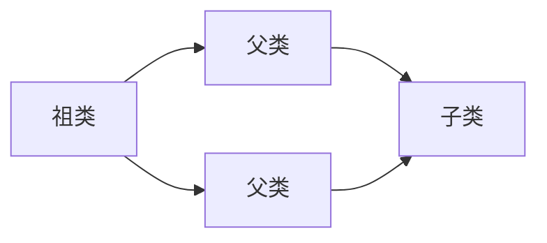
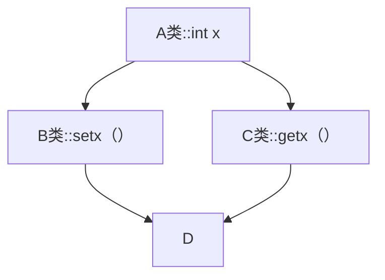
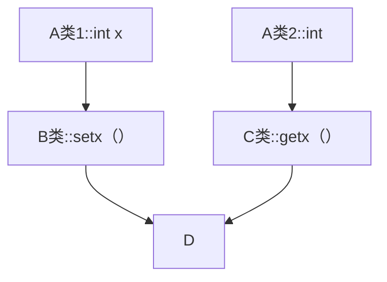

# 继承

## 基本语法

```cpp
class A : public Base {
  //其他定义  
};
```

这里的A类又叫派生类(子类)，Base类又叫基类(父类)，我们怎么描述上面的代码呢？A类公有继承自Base类，除了`public`之外还可以用`private`,`protected`，这将决定继承来的成员在派生类 中新的访问权限，**新的权限是在继承方式和基类权限中的更严格者**，比如public的基类成员经过protected继承就会变成protected的protected成员，而protected成员经过public继承还是protected成员。

> private的成员是始终无法被其他类访问的！不要谈继承

下面用一段代码来演示继承的基本使用：

```cpp
#include <iostream>
using namespace std;

class Animal {
    string name;
public:
    void set(string name) { this->name = name; }
    void say() {
        cout << "I'm " << name << endl;
    }
};

class Cat : public Animal {};
class Dog : public Animal {};
class Bat : public Animal {};

int main(){
    Cat a1;
    Dog a2;
    Bat a3;
    a1.set("Garfield");
    a2.set("Odie");
    a3.set("Dracula");
    a1.say();
    a2.say();
    a3.say();
    return 0;
}
```

这个代码看上去就不舒服，因为名字应该是构造时就设置好，于是我们还可以这样优化：

```cpp
#include <iostream>
using namespace std;

class Animal {
    string name;
public:
    // 假定父类就是不能有默认构造
    Animal() = delete;
    Animal(string name) : name(name) {}
    void set(string name) { this->name = name; }
    void say() {
        cout << "I'm " << name << endl;
    }
};

class Cat : public Animal {
public:
    Cat(string name) : Animal(name) {}
};
class Dog : public Animal {
public:
    Dog(string name) : Animal(name) {}
};
class Bat : public Animal {
public:
    Bat(string name) : Animal(name) {}
};

int main(){
    Cat a1("Garfield");
    Dog a2("Odie");
    Bat a3("Dracula");
    a1.say();
    a2.say();
    a3.say();
    return 0;
}
```

我们可以这样采用委托构造的方式来解决这个问题。

---

然后在此基础上，我们还可以再基类的基础上拓展功能，具体怎么拓展随便，这里便不写了，只是如果子类想要访问name这样的private成员就应该把它改成protected成员。


## 注意事项

### 讨论1：子类对象的大小

```cpp
#include <iostream>
using namespace std;

#define P(name) {\
    printf("class %s : %zd\n", #name, sizeof(name));\
}

class Base {
public:
    int x;
};

class A {
public:
    int y;
    long long z;
};

int main(){
    P(Base);
    P(A);
    return 0;
}
```

先通过这个例子复习一下结构体大小计算规则：对其规则。

而**子类的大小相当于嵌套结构体的大小**。

```
#include <iostream>
using namespace std;

#define P(name) {\
    printf("class %s : %zd\n", #name, sizeof(name));\
}

class Base {
public:
    Base() : x(0x1111111111111111LL) {}
    long long x;
};

class A : public Base {
public:
    A() : y(0x22222222) {}
    int y;
};

void output_address(void *_p, size_t n) {
    unsigned char *p = (unsigned char *)_p;
    printf("%p : ", p);
    for (int i = 0; i < n; i++) {
        if (i % 8 == 0) printf("\n");
        printf("%02X ", p[i]);
    }
}

int main(){
    P(Base);
    P(A);
    A a;
    output_address(&a, sizeof(a));
    return 0;
}
```

```
class Base : 8
class A : 16
000000e9fd7ffaf0 :
11 11 11 11 11 11 11 11
22 22 22 22 E9 00 00 00
```

通过这个例子可以看出：子类中存储了父类中的数据，并且简单继承场景中，父类的数据在前。

### 讨论2：父类指针指向子类对象

> 这主要是因为子类地址可以隐式转换为父类地址，子类对象也可以隐式转换为父类对象，并且绑定到父类的引用上。

```cpp
#include <iostream>
using namespace std;

class Base {
public:
    Base(int x, int y) : x(x), y(y) {}
    int x, y;
};

class A : public Base {
public:
    A(int x, int y, int z) : Base(x, y), z(z) {} 
    int z;
};

void func1(Base *p) {
    cout << "Base : " << p->x << ", " << p->y << endl;
}

int main(){
    A a(3, 4, 5);
    func1(&a); //父类指针绑子类地址
    Base &b = a; // 父类引用绑子类
    b.x = 5;
    b.y = 6;
    func1(&a);

    return 0;
}
```


### 讨论3：初探子类数据的存储结构

> 前面我们学到，单一继承场景下，父类数据在前，子类数据在后，现在我们让场景更复杂一点。

```cpp
#include "ex.h"
using namespace std;


class Base1 {
public:
    Base1() : b1(0x11111111) {}
    int b1;
};

class Base2 {
public:
    Base2() : b2(0x22222222) {}
    int b2;
};

class A : public Base1, public Base2 {
public:
    A() : a(0x33333333) {}
    int a;
};

int main(){
    A a;
    output_address(&a, sizeof(a)); 
    return 0;
}
```

```
000000b45cfffe64 : 
11 11 11 11 22 22 22 22
33 33 33 33
```

我们发现依旧是父类数据在前，而多个父类的存储顺序受继承顺序影响。

---

我们可以让场景更加复杂一些：

```cpp
#include "ex.h"
using namespace std;


class Base1 {
public:
    Base1() : b1(0x11111111) {}
    int b1;
};

class Base2 {
public:
    Base2() : b2(0x22222222) {}
    int b2;
};

class A : public Base1, public Base2 {
public:
    A() : a(0x33333333) {}
    int a;
};

class B : public Base1, public A {
public:
    B() : x(0x44444444) {}
    int x;
};

int main(){
    B b;
    output_address(&b, sizeof(b)); 
    return 0;
}

```

```
000000a56a5ffd30 : 
11 11 11 11 11 11 11 11
22 22 22 22 33 33 33 33
44 44 44 44
```

结果是否和你手动验算一致呢？如果是，我想你懂了。

### 讨论4：子类和父类的构造和析构顺序

这里直接说结论，**子类构造时**，必定要调用父类构造函数，那么**父类先于子类构造**，根据之前掌握的规则，**必定晚于子类析构**。

### 讨论5：显式调用父类的构造函数

> 当父类中有多个构造函数时，子类中如何正确的调用其中某个构造函数呢？答案是初始化列表。

```cpp
#include <iostream>
using namespace std;

class Base {
public:
    Base() : x(3) {
        cout << "Base default constructor" << endl;
    }
    Base(int x) : x(x) {
        cout << "Base(int x) constructor" << endl;
    }
    int x;
};

class A : public Base {
public:
    A() : y(4) {
        cout << "A default constuctor" << endl;
    }
    A(int x) : Base(x) {
        cout << "A(x) constructor" << endl;
    }
    int y;
};
ostream& operator<<(ostream& out, const A& a) {
    out << "(" << a.x << ", " << a.y << ")";
    return out;
}
int main(){
    A a;
    cout << a << endl;
    a.x = 1000, a.y = 999;
    A b = a;
    cout << b << endl;
    return 0;
}
```

同时从上面的代码结果可以看到，A类的拷贝构造会自动调用Base类的拷贝构造，当然是默认的浅拷贝，不难想到应该所有的默认行为都是对应的，要验证这点，读者可以自行显示地写出Base类所有构造函数，看A类调用对应的函数是否会有反馈。

```cpp
#include <iostream>
using namespace std;

class Base {
public:
    Base() : x(3) {
        cout << "Base default constructor" << endl;
    }
    Base(int x) : x(x) {
        cout << "Base(int x) constructor" << endl;
    }
    int x;
};

class A : public Base {
public:
    A() : y(4) {
        cout << "A default constuctor" << endl;
    }
    A(const A& a) : Base(a) {
        this->y = a.y;
    }
    int y;
};
ostream& operator<<(ostream& out, const A& a) {
    out << "(" << a.x << ", " << a.y << ")";
    return out;
}
int main(){
    A a;
    cout << a << endl;
    a.x = 1000, a.y = 999;
    A b = a;
    cout << b << endl;
    return 0;
}
```

这份代码读者首先要理解**为什么Base的拷贝构造可以传一个A类型的对象**，这是因为父类的引用可以绑定在子类上。其次要知道**不写这个显式调用会怎么样**，会调用Base的默认构造。

## 编码技巧：大整形

这里给出一个我竞赛时候用的模板，读者自行阅读理解，不要怕读代码，这是对前面所学的一个测验：

```cpp
struct BigInt : std::vector<int> {
    BigInt(long long n = 0) {
        if (n == 0) { push_back(0); return; }
        while (n > 0) { push_back(n % 10); n /= 10; }
    }
    BigInt(const std::string& s) {
        if (s.empty() || s == "0") { push_back(0); return; }
        for (int i = s.length() - 1; i >= 0; --i) push_back(s[i] - '0');
    }

    void process() {
        for (size_t i = 0; i < size(); ++i) {
            if (at(i) >= 10) {
                if (i + 1 == size()) push_back(0);
                at(i+1) += at(i) / 10;
                at(i) %= 10;
            }
        }
        while (size() > 1 && back() == 0) pop_back();
    }
    
    bool operator<(const BigInt& b) const {
        if (size() != b.size()) return size() < b.size();
        for (int i = size() - 1; i >= 0; --i)
            if (at(i) != b[i]) return at(i) < b[i];
        return false;
    }

    void operator-=(const BigInt& b) {
        for (size_t i = 0; i < b.size(); ++i) at(i) -= b[i];
        for (size_t i = 0; i < size(); ++i) {
            if (at(i) < 0) {
                at(i) += 10;
                at(i + 1)--;
            }
        }
        process();
    }
    

    void operator+=(const BigInt& b) {
        if (b.size() > size()) resize(b.size());
        for (size_t i = 0; i < b.size(); ++i) at(i) += b[i];
        process();
    }
    
    void operator*=(int n) {
        if (n == 0) { *this = BigInt(0); return; }
        long long carry = 0;
        for (size_t i = 0; i < size(); ++i) {
            carry += (long long)at(i) * n;
            at(i) = carry % 10;
            carry /= 10;
        }
        while (carry > 0) { push_back(carry % 10); carry /= 10; }
        process();
    }

    BigInt div(int n, int& rem) const {
        BigInt q; q.clear();
        rem = 0;
        for (int i = size() - 1; i >= 0; --i) {
            rem = rem * 10 + at(i);
            q.push_back(rem / n);
            rem %= n;
        }
        std::reverse(q.begin(), q.end());
        q.process();
        return q;
    }

    BigInt operator+(const BigInt& b) const { BigInt r = *this; r += b; return r; }
    BigInt operator-(const BigInt& b) const { BigInt r = *this; r -= b; return r; }
    BigInt operator*(int n) const { BigInt r = *this; r *= n; return r; }
    BigInt operator/(int n) const { int rem; return div(n, rem); }
    int operator%(int n) const { int rem; div(n, rem); return rem; }
};


std::ostream& operator<<(std::ostream& os, const BigInt& b) {
    for (int i = b.size() - 1; i >= 0; --i) os << b[i];
    return os;
}
std::istream& operator>>(std::istream& is, BigInt& b) {
    std::string s; is >> s; b = BigInt(s); return is;
}
```

# 多重继承

## 多重继承的基础

先展示基础语法：

```cpp
class Base1 {};
class Base2 {};
class A : public Base1, private Base2 {};
```

C++标准没有限制继承的数量，具体取决于编译器的实现。

---

看到这里读者难免问，这有什么用？答案是**功能拼装**。我们可以**实现一系列功能类，为主要类提供功能插件**。

## 菱形继承及虚继承



如上所示就是菱形继承，这是一个有问题的继承，我们可以用一个简单的例子来揭示：



我这里提出一个问题：

> [!IMPORTANT]
>
> 如果此时有一个D类对象，先调用继承自B类的`setx`，再调用继承自C类的`getx`，会怎么样？会是我们想象中的结果吗？读者不妨自己试试，答案是不会。

```cpp
#include <iostream>
using namespace std;

class A {
public:
    int x;
};

class B : public A {
public:
    void setx(int x) {
        this->x = x;
    }
};

class C : public A {
public:
    int getx() {
        return this->x;
    }
};

class D : public B, public C {};

int main(){
    D d;
    d.setx(3);
    cout << d.getx() << endl;
    return 0;
}
```

结果明确告诉我们，实际的继承关系应该如下图所示：



那如何解决这个问题呢？我们只需要告诉编译器把相同的字段给合并了，怎么做到呢？答案是**虚继承**，它的作用是合并同类字段，看代码：

```cpp
#include <iostream>
using namespace std;

class A {
public:
    int x;
};

class B : virtual public A {
public:
    void setx(int x) {
        this->x = x;
    }
};

class C : virtual public A {
public:
    int getx() {
        return this->x;
    }
};

class D : public B, public C {};

int main(){
    D d;
    d.setx(3);
    cout << d.getx() << endl;
    return 0;
}
```


## 对象模型

> C++语言标准规定了语法，但是没有规定底层究竟如何存储类的对象，这个就是对象模型。

我们这里要简述一下**虚继承场景的对象模型**。

> [!WARNING]
>
> 注意，**这些内容是和编译环境相关的，标准未定义，对于学习C++语法的同学可以跳过。**

```cpp
/// @brief 打印从ptr开始往后n个字节上的数据
/// @param ptr 起始指针
/// @param n 字节数
void print_addres(uintptr_t ptr, int n) {
    unsigned char *p = (unsigned char *)ptr;
    printf("address %p :\n", p);
    for (int i = 0; i < n; i++) {
        printf("%02X", p[i]);
        if ((i + 1) % 4 == 0) cout << " ";
        if ((i + 1) % 8 == 0) cout << endl;
    }
    cout << endl;
}
```

读者可以自行使用这个打印工具来查看虚继承场景下的内存数据。

### 首先看菱形继承

```cpp
#include <cstdint>
#include <iostream>
using namespace std;

/// @brief 打印从ptr开始往后n个字节上的数据
/// @param ptr 起始指针
/// @param n 字节数
void print_addres(uintptr_t ptr, int n) {
    unsigned char *p = (unsigned char *)ptr;
    printf("address %p :\n", p);
    for (int i = 0; i < n; i++) {
        printf("%02X", p[i]);
        if ((i + 1) % 4 == 0) cout << " ";
        if ((i + 1) % 8 == 0) cout << endl;
    }
    cout << endl;
}

class A {
public:
    int x;
};

class B : public A {
public:
    B() {
        this->x = 0xbbbbbbbb;
    }
    void setx(int x) {
        this->x = x;
    }
};

class C : public A {
public:
    C() {
        this->x = 0xcccccccc;
    }
    int getx() {
        return this->x;
    }
};

class D :  public B, public C {};

int main(){
    D d;
    print_addres((uintptr_t)&d, sizeof(d));
    return 0;
}
```

```
address 0000006579fff718 :
BBBBBBBB CCCCCCCC
```

### 再看虚继承

```cpp
#include <cstdint>
#include <iostream>
using namespace std;

/// @brief 打印从ptr开始往后n个字节上的数据
/// @param ptr 起始指针
/// @param n 字节数
void print_addres(uintptr_t ptr, int n) {
    unsigned char *p = (unsigned char *)ptr;
    printf("address %p :\n", p);
    for (int i = 0; i < n; i++) {
        printf("%02X", p[i]);
        if ((i + 1) % 4 == 0) cout << " ";
        if ((i + 1) % 8 == 0) cout << endl;
    }
    cout << endl;
}

class A {
public:
    int x;
};

class B : virtual public A {
public:
    B() {
        this->x = 0xbbbbbbbb;
    }
    void setx(int x) {
        this->x = x;
    }
};

class C : virtual public A {
public:
    C() {
        this->x = 0xcccccccc;
    }
    int getx() {
        return this->x;
    }
};

class D :  public B, public C {};

int main(){
    D d;
    print_addres((uintptr_t)&d, sizeof(d));
    return 0;
}
```

```
address 00000076e1bffa10 :
389A018D F67F0000
509A018D F67F0000
CCCCCCCC 76000000
```

我们发现除了存储x之外，还有一些奇奇怪怪的东西。

> [!CAUTION]
>
> 实际上，前16个字节存储了一些地址，指向另外的空间，这些空间存储的数据和x的偏移量有关。


