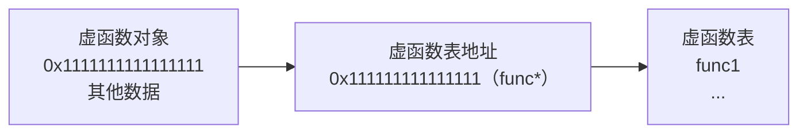

# 多态

## 基本概念：多态的基本分类

> 主要分为**编译时多态**和**运行时多态**

在编程语言和类型论中，**多态Polymorphism**指的是为不同数据类型的实体统一的接口。

> [!NOTE]
>
> 这听着怎么这么像**函数重载/运算符重载**，其实它就是其中一种。

我们不妨复习一下程序编译的流程：


而多态根据其所处的**时期不同**划分成了**编译时多态和运行时多态**。

什么叫做所处时期不同？**即确定使用具体哪个接口的时期，编译期多态可以理解为我们根据代码就能判断使用的是哪个接口，运行时多态则只有看到运行结果才能知道使用的是哪个接口。**

## 运行时多态：虚函数和纯虚函数

### 先看问题

```cpp
#include <iostream>
using namespace std;

class Animal {
public:
    void run() {
        cout << "I don't know how to run" << endl;
    }
};

class Cat : public Animal {
public:
    void run() {
        cout << "I can run with four legs" << endl;
    }
};

int main(){
    Cat c;
    Animal *p = &c;
    c.run();
    p->run();
    return 0;
}
```

明明都是指向猫对象，但是调用`run`方法的时候，父类指针会调父类方法，子类会直接调用自己的方法，这在现实世界里面非常反逻辑。

### 虚函数

我们可以通过给父类的同名方法加上`virtual`关键字来解决这个问题，至于子类可以**选择性**加上`override`，但是**建议加上**，这是很好的习惯，可以提高可读性。

```cpp
#include <iostream>
using namespace std;

class Animal {
public:
    virtual void run() {
        cout << "I don't know how to run" << endl;
    }
};

class Cat : public Animal {
public:
    void run() override {
        cout << "I can run with four legs" << endl;
    }
};

int main(){
    Cat c; 
    Animal *p = &c;
    c.run();
    p->run();
    
    return 0;
}
```

> [!IMPORTANT]
>
> 总结一下就是，普通的成员方法是跟着类走的，而虚函数是跟着对象走的，是什么对象就调用什么方法。

所以不难得出一个结论，**析构函数一定要是虚函数**，否则会造成内存泄漏等问题，因为可能会调用父类的析构，而没有调用对象的析构函数。

### override的实际作用

> C++中很多关键字并不是为了功能实现，而是代码检查。

它的作用就是帮助我们做检查，因为如果对非虚函数添加`override`关键字就会报错，防止因为手误导致的错误，让bug暴露在编译期。

### final关键字

> 作用是**定义最后一个被重写的虚函数版本**，也是一个代码检查性的关键字，可以防止子类重写原方法。

通常个人开发用不上这个关键字，但是如果你是某个库的提供者，不希望用户修改类中的方法就可以使用final。

### 纯虚函数

基础语法：

```cpp
virtual void func() = 0;
```

特点：

- 父类不需要实现定义
- 子类必须实现定义

## C++类型转换

> 此前我们已经学过**隐式类型转换**和**强制类型转换**，C++还有几种标准的转换方法，其中**最主要的是静态转换，其他三个为辅**。

### 静态转换：static_cast

有人问既然C语言已经有强制类型转换这么灵活的方法了，为什么C++还要引入这几种呢？原因就是因为它太灵活了，这意味着不太安全，一是笔误可能无法发现，二是可读性差。

先看看基础语法:

```cpp
int x = 123;
double p = static_cast<double>(x);
```

就是在尖括号里面放上目标类型，但是**静态转换只允许同类转换**，这里的**同类指的是数字类这样的大类(int/long/short/float/double)**，注意，**不同类型的指针不算同类，但存在继承关系的类属于同类**。

**更加深刻地理解：之前学过转换构造和转换赋值运算符，其实静态转换就是去调用这个转换构造的，所以可以理解为存在这样的转换构造的类就可以静态转换**。

其实具体什么类型不能转换不用急着记忆，可以随着往后学习去记忆，因为后面几种方法就是为了应对这些不能转换的场景的。

### 动态转换：dynamic_cast

```cpp
#include <iostream>
using namespace std;

class Base {
public:
    virtual ~Base() {}
};

class A : public Base {};
class B : public Base {
public:
    void output() {
        cout << x << ", " << y << endl;
    }
    int x, y;
};

int main(){
    A *p1 = new A();
    Base *p2 = p1;
    B *p3 = static_cast<B *>(p2);
    p3->output();
    // 当我们把A类对象当做B类对象看待，我们就会访问到不属于对象的空间
    return 0;
}
```

静态转换允许**父子类之间的转换**，这导致连续使用也将导致**允许兄弟之间的转换**，但是可能造成访问越界，如何避免这种危险，**按照原本对象的类型来判断转换能否进行**呢？动态类型转换就是用来解决这个问题的。

```cpp
#include <iostream>
using namespace std;

class Base {
public:
    virtual ~Base() {}
};

class A : public Base {};
class B : public Base {
public:
    void output() {
        cout << x << ", " << y << endl;
    }
    int x, y;
};

int main(){
    A *p1 = new A();
    Base *p2 = p1;
    B *p3 = dynamic_cast<B *>(p2);//失败就会返回空地址
    if (p3 == nullptr) cout << "Failed\n";
    else cout << "Succeed\n";
    
    return 0;
}
```

此处p1一开始要是申请的是B对象，最后就能成功。

### 常量转换：const_cast

```cpp
#include <iostream>
using namespace std;

int main(){
    const int x = 123;
    const int *p = &x;
    int *p2 = static_cast<int*>(p);
    // 指向常亮的指针是不允许转换为普通指针的
    return 0;
}
```

这个时候，常量转换就发挥作用了：

```cpp
#include <iostream>
using namespace std;

int main(){
    const int x = 123;
    const int *p = &x;
    int *p2 = const_cast<int*>(p);
    *p2 = 456;
    cout << *p << endl;
    //但是x是始终不变的,但是x的地址确实是p,这是为什么？
    return 0;
}
```

面对疑问，我必须指出在**这个场景中使用const_cast并不合理，因为它的诞生不是为了让用户可以修改const变量，而是为了处理变量本身非const，只是被const指针或引用传参导致的类型问题。**

### 指针转换：reinterpret_cast

```cpp
#include <cstdio>
#include <iostream>
using namespace std;

int main(){
    int a, b, c, d;
    scanf("%d.%d.%d.%d", &a, &b, &c, &d);
    unsigned int n;
    char *p = (char *)&n;
    p[0] = a;
    p[1] = b;
    p[2] = c;
    p[3] = d;
    printf("%u\n", n);
    return 0;
}
```

我们在需要**重新以某种类型解释某段内存时**就会使用**指针转换**，C++中就可以使用**reinterpret_cast**。

```cpp
#include <cstdio>
#include <iostream>
using namespace std;

int main(){
    int a, b, c, d;    
    scanf_s("%d.%d.%d.%d", &a, &b, &c, &d);
    unsigned int n;
    char *p = reinterpret_cast<char *>(&n);
    p[0] = a;
    p[1] = b;
    p[2] = c;
    p[3] = d;
    printf("%u\n", n);
    return 0;
} 
```


## 探究虚函数的对象模型

> 凭什么普通函数跟着类走，但是虚函数跟着对象走？

先说结论：拥有虚函数的对象实际存储的头部有一个地址，指向**虚函数表**，所以该对象总能通过这个表调用自己的虚函数，而且不难想到，C++的设计者应该只为每一个类准备了一张虚函数表，所有有虚函数的类都共用同一张表。





读者可以使用以下的代码来验证：

```cpp
#include <iostream>
using namespace std;

class Base {
public:
    virtual void test() {
        cout << "Class Base" << endl;
    }
    virtual void test2(int x) {
        cout << "Class Base : " << x << endl;
    }
};

class A : public Base {
public:
    ///@brief 无参数的虚函数
    void test() override {
        cout << "Class A" << endl;
    }
    ///@brief 有参数的虚函数
    ///@param x 
    void test2(int x) override {
        cout << "Class A : " << x << endl;
    }
};

/// 定义函数指针类型别名
typedef void (*funcT)();
typedef void (*funcT2)(int x);

///@brief 我们要验证虚函数表的存在，就要通过虚函数表来调用虚函数
///@return int 
int main(){
    A a;
    cout << "virtual table address : " << ((funcT **)(&a))[0] << endl;
    ((funcT **)(&a))[0][0]();
    a.test2(100);
    ((funcT2 **)(&a))[0][1](100);
    return 0;
} 
```

这里留下一个疑问，**有参的虚函数通过虚函数表调用为什么和直接调用结果不同**？这个问题就需要**深入理解this指针**了。

---

我们回忆一下this指针的特点：

- 只能在成员方法中调用
- 存储的是当前对象的地址

我们稍微修改一下之前的代码，就能发现端倪：

```cpp
#include <iostream>
using namespace std;

class Base {
public:
    virtual void test() {
        cout << "Class Base" << endl;
    }
    virtual void test2(int x) {
        cout << "Class Base : " << x << endl;
    }
};

class A : public Base {
public:
    ///@brief 无参数的虚函数
    void test() override {
        cout << "Class A" << endl;
    }
    ///@brief 有参数的虚函数
    ///@param x 
    void test2(int x) override {
        cout << this << " test2: Class A : " << x << endl;
    }
};

/// 定义函数指针类型别名
typedef void (*funcT)();
typedef void (*funcT2)(int x);

///@brief 我们要验证虚函数表的存在，就要通过虚函数表来调用虚函数
///@return int 
int main(){
    A a;
    cout << "virtual table address : " << ((funcT **)(&a))[0] << endl;
    ((funcT **)(&a))[0][0]();
    a.test2(100);
    ((funcT2 **)(&a))[0][1](100);
    return 0;
} 
```

```
virtual table address : 0x7ff708dd45f0
Class A
0x6a085ff8f8 test2: Class A : 100
0x64 test2: Class A : 1926890888
```

> [!NOTE]
>
> 注意到：**0x64=100**

于是我们就发现了，**对成员方法来说，有一个隐藏参数，位于第一位，即我们的this指针**，所以我们传入的100变成this指针输出了。

```cpp
#include <iostream>
using namespace std;

class Base {
public:
    virtual void test() {
        cout << "Class Base" << endl;
    }
    virtual void test2(int x) {
        cout << "Class Base : " << x << endl;
    }
};

class A : public Base {
public:
    ///@brief 无参数的虚函数
    void test() override {
        cout << "Class A" << endl;
    }
    ///@brief 有参数的虚函数
    ///@param x 
    void test2(int x) override {
        cout << this << " test2: Class A : " << x << endl;
    }
};

/// 定义函数指针类型别名
typedef void (*funcT)();
typedef void (*funcT2)(A *, int x);

///@brief 我们要验证虚函数表的存在，就要通过虚函数表来调用虚函数
///@return int 
int main(){
    A a;
    cout << "virtual table address : " << ((funcT **)(&a))[0] << endl;
    ((funcT **)(&a))[0][0]();
    a.test2(100);
    ((funcT2 **)(&a))[0][1](&a, 100);
    return 0;
} 
```

当我们增加指针定义中的参数，调用时传入a的地址，就发现，一切如我们一开始预想的一样。

## 多态的应用：访问者模式

### 问题的引出

```cpp
#include <iostream>
using namespace std;

class Base {
public:
    virtual ~Base() {}
};
class A : public Base {};
class B : public Base {};
class C : public Base {};
int main(){
    srand(time(0));
    Base *p;
    switch (rand() % 3) {
        case 0: p = new A; break;
        case 1: p = new B; break;
        case 2: p = new C; break;
    }
    // 如果我只拿到了p，如何根据p的类型不同执行不同操作
    
    //首先我们不能对上层提供的这些类做修改，利用虚函数的多态特性解决问题就不行，于是想到用dynamic_cast
    if (dynamic_cast<A *>(p) != nullptr) {
        cout << "A" << endl;
    } else if (dynamic_cast<B *>(p) != nullptr) {
        cout << "B" << endl;
    } else if (dynamic_cast<C *>(p) != nullptr) {
        cout << "C" << endl;
    }

    return 0;
}
```

虚函数是调用简洁，但是需要修改类的代码，动态类型转换是调用复杂，但不用修改类，而我们即将要学的访问者模式架构，可以将两者的长处融合。

###  架构介绍

> 使用场景：
>
> - 需要根据派生类的类型执行不同操纵
> - 不希望通过增加类的成员方法来实现
> - 代码维护方便，功能拓展方便

访问者模式同时使用了**编译时多态**和**运行时多态**，**通过重载函数的方式来解决，但是我们拿到的不是原类型的指针，所以我们需要把原类型给解析出来，通过虚函数找到对象的this指针，这个指针类型是原类型的指针**。

### 代码实现

```cpp
#include <iostream>
using namespace std;

class A;
class B;
class C;

class Base {
public:
    class IVisitor {
    public:
        virtual void visit(A *) = 0;
        virtual void visit(B *) = 0;
        virtual void visit(C *) = 0;
    };
    virtual void Accept(IVisitor *) = 0;
    virtual ~Base() {}
};
class A : public Base {
public:
    void Accept(IVisitor *vis) override {
        //visit(this) --> visit(A *)
        vis->visit(this); 
    }
};
class B : public Base {
public:
    void Accept(IVisitor *vis) override {
        //visit(this) --> visit(B *)
        vis->visit(this);
    }
};
class C : public Base {
public:
    void Accept(IVisitor *vis) override {
        //visit(this) --> visit(C *)
        vis->visit(this);
    }
};

class DynamicVisitor : public Base::IVisitor {
public:
    void visit(A *obj) override {
        cout << "A" << endl;
    }
    void visit(B *obj) override {
        cout << "B" << endl;
    }
    void visit(C *obj) override {
        cout << "C" << endl;
    }
};

int main(){
    srand(time(0));
    Base *p;
    switch (rand() % 3) {
        case 0: p = new A; break;
        case 1: p = new B; break;
        case 2: p = new C; break;
    }
    DynamicVisitor vis;
    p->Accept(&vis);
    return 0;
}
```

