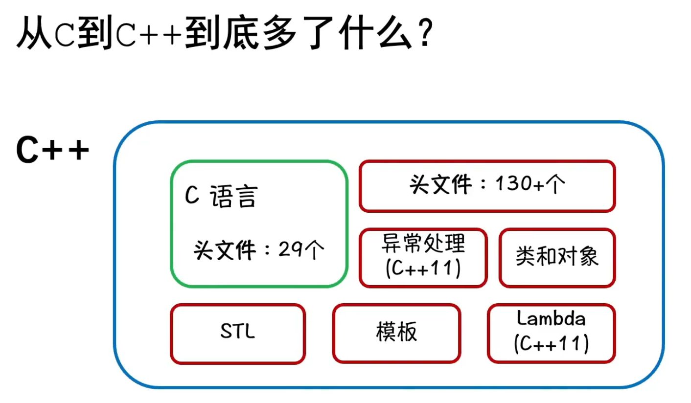
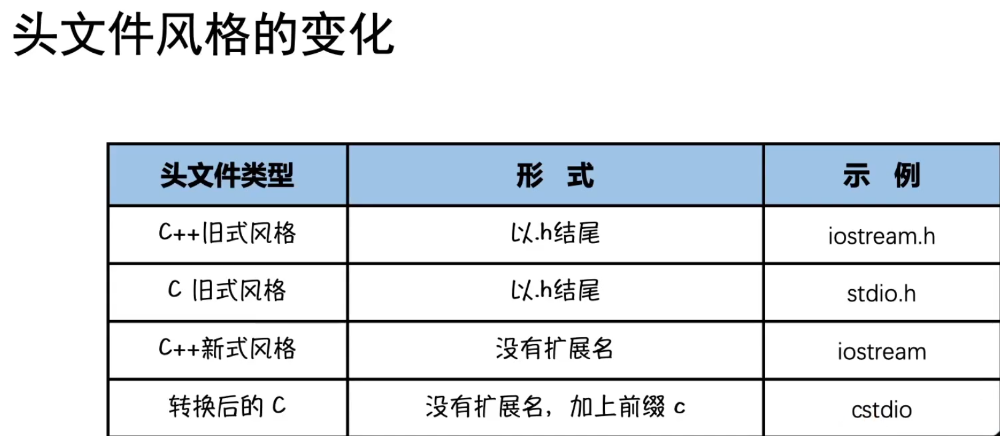
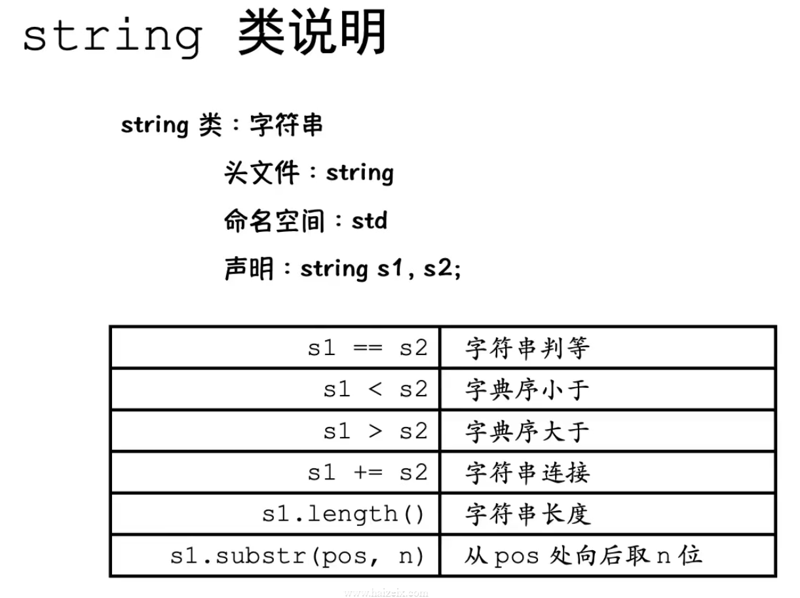

## 绪论

### 本教程需要什么基础

#### 熟练掌握C语言

#### 有一定的算法数据结构基础

### 本教程包括什么  

#### 入门篇

从C到C++，多了什么？

- 组成部分  

可以说C++几乎继承了C语言所有特性

- 头文件风格变化


- 输入输出的增加

C++中当然还能使用C语言的`printf`和`scanf`，但是也引入了独属于C++的输入输出方式`cin`和`cout`，它们定义在头文件`iostream`中，这在一会儿将会用到。
```cpp
#include <iostream>
#include <iomanip>
using namespace std;

int main() {
    // 要读取内容，不管类型，直接用'>>' 拼接
    // 比如读取两个整数
    int a, b;
    cin >> a >> b;
    // 循环输入
    while(cin >> a);
    // 要输出内容，不管什么类型，直接用`<<` 拼接即可
    cout << "hello, " << "c++" << endl; 
    cout << 3.14 << endl; // 等同于%g
    cout << setprecision(5) << 3.14 << endl;
    //浮点数输出格式设置,使用setprecision(设置有效数字)要包含iomanip
    //不会补0
    cout << fixed <<setprecision(5) << 3.14 << endl;//加一个fixed就变成保留固定小数位数
    return 0;
}
```
为什么引入新的读入读出方法之后还要保留C的读入读出呢？那是因为二者各有优劣，书写方式显然`cin`和`cout`在某些时候更加方便，但也有不方便的时候(如格式控制)，而读取和输出速度`printf`和`scanf`快得多。

值得一提，`cin`和`cout`并不是函数，这一点后续章节还会讨论，此处简单了解就行。

除此之外`cout`还可以通过**运算符重载**来达到定制化输出的功能，比如下面这个例子：
```cpp
#include <iostream>
#include <iomanip>
using namespace std;

struct Point
{
    int x, y;
};

ostream &operator<<(ostream& out, const Point& obj) {
    out << "(" << obj.x << ", " << obj.y << ")";
    return out;
}

int main() {
    Point p1 = {3, 4}, p2 = {5, 99};
    printf("p1 = (%d, %d)\n", p1.x, p1.y);
    cout << "p2 = " << p2 << endl;
    return 0;
}
```
这里不需要掌握原理，只需要知道cout能够做到定制化输出非内建类型。

- 名称空间的引入
```cpp
// 名称空间的定义
namespace name {
    //some declarations and implementations
}
// 名称空间的使用
name::variable = ?
name::function();
// 也可以直接引入名称空间所有内容，便可以不用使用::域限定符，直接调用。
// 但是在中大型项目中严禁使用这种方式
using namespace name;
function()
variable = ?
// 也可以使用 using 单独引入某个内容
using name::function;
function();
```
大家可能觉得这个功能没用，但是在实际的大型项目开发中，很可能为了方便符合语义需要定义多个同名标识符，为了使他们不起冲突，就需要使用名称空间，更何况，C++比C语言多了130个头文件，标识符冲突的可能性极大，这也是名称空间存在的意义。

最后做一个作用总结：
1. 避免**标识符冲突**
2. 提高代码**可读性**和**可维护性**
3. **匿名名称空间**可以批量声明静态全局变量
```cpp
#include <iostream>

namespace {
    int a;
}

int main() {
    std::cout << a << std::endl;
}
```
4. 类也是一种特殊的名称空间

- C++引用

这是对指针的优化，避免了对地址上数据操作前的解引用操作，减少了代码量, 可以把变量的引用当做原变量的别名，操作引用就等同于操作原变量。
```cpp
#include <iostream>
using namespace std;

void swap(int& a, int& b) {
    int c = b;
    b = a;
    a = c;
}

int main() {
    int a = 3, b = 4;
    swap(a, b);
    cout << a << ", " << b << endl;
    return 0;
}
```
值得一提，引用需要在声明时完成绑定，否则就会报错，而且此处对引用的介绍只是一个比较简单的介绍，后续章节还会详细介绍的。

- String类的基本使用



```cpp
#include <iostream>
using namespace std;
// 此处没引入string头文件，是因为windows平台的iostream包含了这个头文件
// 很多头文件都会用到string所以不用重复include
// 但不保证跨平台兼容性，所以最好写上

int main() {
    string a, b;
    cin >> a >> b;
    cout << a + b << endl;
    cout << a.size() << b.length() << endl;
    cout << a[0] << b[0] << endl;
    cout << a.substr(0, 2) << endl;
}
```

#### 基础篇

- 封装
- 继承
- 多态
- 模板
- 异常处理

#### 高级篇

- 初探设计模式
- 初探STL源码
- 现代C++
- 编程范式
    - 面向过程
    - 面向对象
    - 泛型编程
    - 函数式编程
    - 模板元编程

或许在这里空谈编程范式读者不会懂，但读者只需要知道，目前这几乎就是所有的编程范式，而C++对这五种范式支持都很好，这就是为什么C++程序员转其他语言要比反着来简单的多，这里作者用一个简单的加法函数来展示一下五种编程范式。

```cpp
#include <iostream>
using namespace std;

int add1(int a, int b) {
    return a + b;
}

class ADD {
public:
    int operator()(int a, int b) {
        return a + b;
    }
} add2;

template<typename T, typename U>
auto add3(T a, U b) -> decltype(a + b) {
    return a + b;
}

auto add4 = [](int a, int b) -> int {
    return a + b;
};

template<int N, int M>
struct add5 {
    static const int r = N + M;
};


int main() {
    cout << add1(3, 4) << endl;
    cout << add2(3, 4) << endl;
    cout << add3(3, 4) << endl;
    cout << add4(3, 4) << endl;
    cout << add5<3, 4>::r << endl;
    return 0;
}
```

### 应用篇